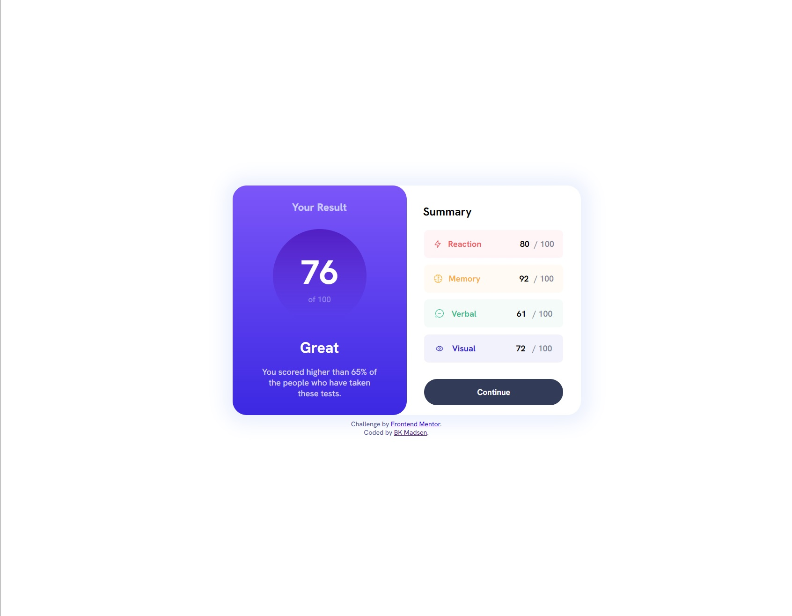

# Frontend Mentor - QR code component solution

This is a solution to the [QR code component challenge on Frontend Mentor](https://www.frontendmentor.io/challenges/qr-code-component-iux_sIO_H). Frontend Mentor challenges help you improve your coding skills by building realistic projects.

## Table of contents

- [Overview](#overview)
  - [Screenshot](#screenshot)
  - [Links](#links)
- [My process](#my-process)
  - [Built with](#built-with)
  - [What I learned](#what-i-learned)
  - [Continued development](#continued-development)
  - [Useful resources](#useful-resources)
- [Author](#author)

## Overview

### Screenshot

### Links

- Solution URL: [Add solution URL here](https://your-solution-url.com)
- Live Site URL: [Add live site URL here](https://your-live-site-url.com)

## My process

### Built with

- Semantic HTML5 markup
- CSS custom properties
- Flexbox

### What I learned

I was happy with my continued development in using flex box to build dynamic and responsive components.

### Continued development

-Responsive design
-Use of EM/REM correctly for responsive web

### Useful resources

- [Border Radius Generator](https://developer.mozilla.org/en-US/docs/Web/CSS/CSS_Backgrounds_and_Borders/Border-radius_generator) - Assisted with ensureing border radius were as close as possible to the original design.

## Author

- Website - [Ben Madsen](https://www.bkmadsen.com)
- Frontend Mentor - [@MadsenBK](https://www.frontendmentor.io/profile/MadsenBK)
